
## 1.研究背景与意义


随着工业化和城市化的快速发展，钢铁行业在全球范围内扮演着重要的角色。钢铁生产过程中，钢包挂钩调度指挥系统起着至关重要的作用。该系统负责钢包的运输和装卸，直接影响到钢铁生产的效率和质量。因此，改进和优化钢包挂钩调度指挥系统对于提高钢铁生产的效率和质量具有重要意义。
起重机一天进行16小时的高强度作业，车间内环境较为嘈杂，吊车司机全程依靠地面观察员的指挥和自己的经验控制起重机，完成撞钩、起吊、运输和落钩的工作。虽然事故发生率非常低，但是一旦发生，其后果和付出的代价是不可估量的，此外还会造成极大的社会不良影响。所以非常有必要的预防此类事故发生，降低钢包倾覆事故。

目前，传统的钢包挂钩调度指挥系统存在一些问题。首先，传统系统往往依赖人工经验和手动操作，容易出现人为错误和调度不合理的情况。其次，传统系统的算法和模型较为简单，无法充分考虑到实际生产中的复杂情况和约束条件。再次，传统系统的响应速度较慢，无法满足快速变化的生产需求。
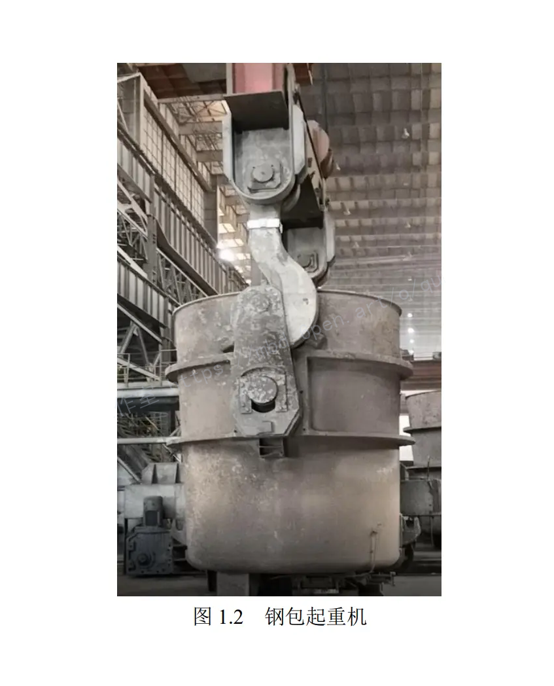

为了解决这些问题，研究人员提出了基于改进SOLO的钢包挂钩调度指挥系统。SOLO（Single-Objective Optimization）是一种常用的优化算法，可以通过对目标函数进行优化，得到最优解。在传统SOLO算法的基础上，研究人员对其进行了改进，使其更适用于钢包挂钩调度指挥系统的优化问题。

改进SOLO的钢包挂钩调度指挥系统具有以下几个方面的意义。首先，通过引入优化算法，可以减少人工干预和手动操作，提高调度的准确性和可靠性。其次，改进的算法和模型可以更好地考虑到实际生产中的复杂情况和约束条件，使得调度更加合理和高效。再次，改进SOLO算法的快速响应能力可以满足快速变化的生产需求，提高钢铁生产的灵活性和适应性。

此外，基于改进SOLO的钢包挂钩调度指挥系统的部署教程和源码的开放共享也具有重要意义。首先，部署教程可以帮助钢铁企业快速实施该系统，提高生产效率和质量。其次，源码的开放共享可以促进学术界和工业界的合作与交流，推动相关领域的研究和发展。最后，源码的开放共享还可以为其他行业和领域提供借鉴和参考，推动优化算法在实际应用中的推广和应用。

综上所述，基于改进SOLO的钢包挂钩调度指挥系统在提高钢铁生产效率和质量方面具有重要意义。通过优化算法和模型的改进，可以减少人为错误和调度不合理的情况，提高调度的准确性和可靠性。此外，部署教程和源码的开放共享也可以促进学术界和工业界的合作与交流，推动相关领域的研究和发展。因此，基于改进SOLO的钢包挂钩调度指挥系统的研究具有重要的理论和实际意义。

# 2.图片演示
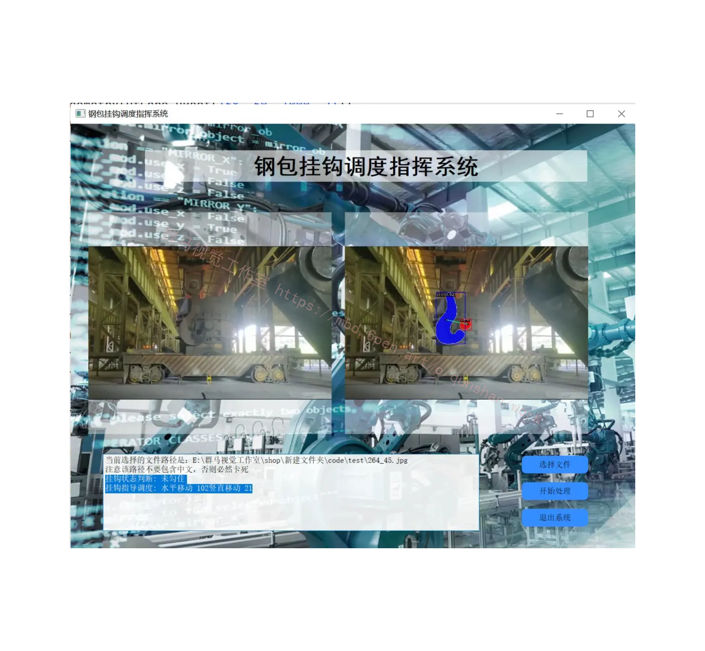

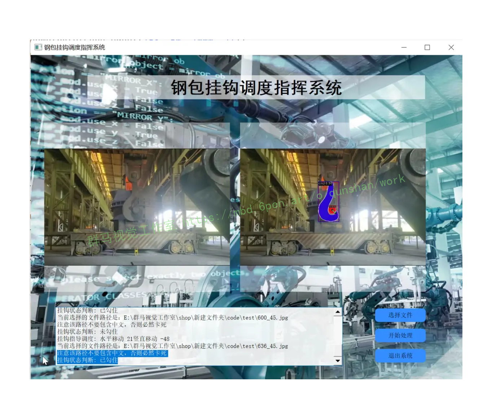

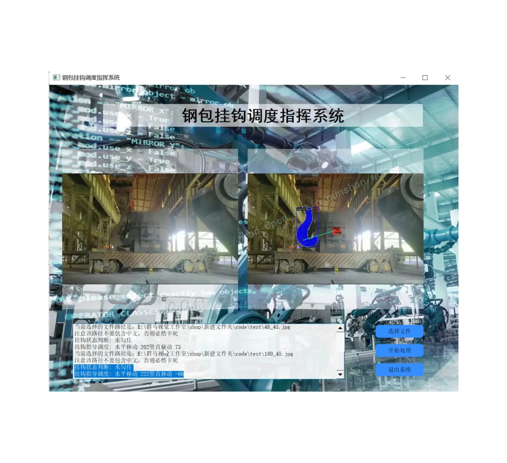

# 3.视频演示
[基于改进SOLO的钢包挂钩调度指挥系统（部署教程＆源码）_哔哩哔哩_bilibili](https://www.bilibili.com/video/BV1Tj411q7Lu/?vd_source=ff015de2d29cbe2a9cdbfa7064407a08)

# 4.问题建模
起重机按照结构分类主要包括轻型起重设备、门式起重机、桥式起重机和臂架式起重机。其中，桥式起重机又被称作天车，它主要应用于车间和和封闭的仓库内。它两端架在固定的混凝土钢筋架或者金属架上，因外型像桥，所以被称为桥式起重机。在钢铁冶炼车间中，桥式起重机利用吊钩勾住钢包耳轴运输高温熔融钢铁，这种起重机也称为钢包起重机，如图所示。随着现代化工业生产的革新，产品的生产越来越趋向智能化和无人化，不可否认的是，智能化时代让生产技术的水平和效率从受益颇多。目前国内也有很多重型机械企业正努力研究大型起重设备的安全监测系统，其中钢包吊钩安全监测系统是其中不可或缺的一部分。在大型的钢铁冶炼车间，钢包起重机在钢铁冶炼流程中发挥着重要的作用。在钢铁冶炼工艺流程中，首先将原材料包括铁矿石、煤和石灰等焦化烧结，然后将铁水脱硫，最后再送到转炉中进行精炼。这几个工艺流程是在不同的生产车间内完成的，完成一种工艺流程后需要转运到下一个工艺车间内进行冶炼。所以，在这个转运过程中钢包起重机扮演着不可替代的角色。钢包起重机两侧的高架上安装有纵向的导轨，其桥架沿着导轨纵向运行。桥架下面比较空旷，可起吊转运物料，避开地面设备和物料的干涉。它是目前使用最普遍、数量最多的一种起重机。在钢包起重机作业的过程中，驾驶员通过操控小车使双吊钩撞击钢包的两个耳轴使起重机进行挂钩处理，地面工作人员检查吊钩是否正常的钩住钢包两个耳轴，即在钢包耳轴处就位，如图所示，然后再指挥驾驶员进行起吊运输作业。但是由于起重机双吊钩工作较为频繁，撞钩、起吊和运输频率极高，并且现场的铁屑粉尘比较多，视线并不清晰，地面人员难免存在指挥失误的问题，这有可能导致吊钩没有完全挂钩，即只是两个或者其中一个钩子的钩尖勾住了钢包的耳轴就开始起吊。因此，起重机在运输过程当中稍微受一点外力的作用就会引起钢包滑落，钢包中数十吨将近1500℃的钢水倾泄而出，导致周围的工作人员几乎没有逃生的可能性。国内有相关部门经过调研后发现，在桥式起重机事故中，由于指挥操作失误而引起的安全事故占有很大比例。例如，某钢厂生产车间突发过钢包倾覆事故，直接导致数十人死亡、多人重伤，这时常提醒着我们在工业生产中，安全是最首要的问题。
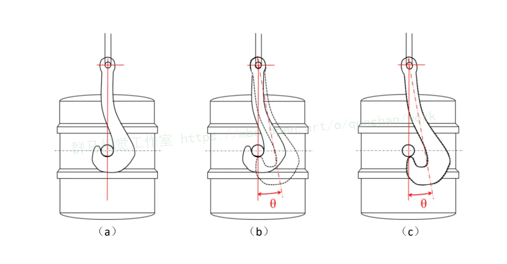


## 5.核心代码讲解

#### 5.1 decoupled_solo_light_r50_fpn_3x_coco.py

根据给定的代码，我将封装为一个名为`ModelConfig`的类，其中包含了模型的配置信息。

```python
class ModelConfig:
    def __init__(self):
        self.model = dict(
            mask_head=dict(
                type='DecoupledSOLOLightHead',
                num_classes=80,
                in_channels=256,
                stacked_convs=4,
                feat_channels=256,
                strides=[8, 8, 16, 32, 32],
                scale_ranges=((1, 64), (32, 128), (64, 256), (128, 512), (256, 2048)),
                pos_scale=0.2,
                num_grids=[40, 36, 24, 16, 12],
                cls_down_index=0,
                loss_mask=dict(
                    type='DiceLoss', use_sigmoid=True, activate=False,
                    loss_weight=3.0),
                loss_cls=dict(
                    type='FocalLoss',
                    use_sigmoid=True,
                    gamma=2.0,
                    alpha=0.25,
                    loss_weight=1.0),
                norm_cfg=dict(type='GN', num_groups=32, requires_grad=True)))

        self.img_norm_cfg = dict(
            mean=[123.675, 116.28, 103.53], std=[58.395, 57.12, 57.375], to_rgb=True)
        self.train_pipeline = [
            dict(type='LoadImageFromFile'),
            dict(type='LoadAnnotations', with_bbox=True, with_mask=True),
            dict(
                type='Resize',
                img_scale=[(852, 512), (852, 480), (852, 448), (852, 416), (852, 384),
                           (852, 352)],
                multiscale_mode='value',
                keep_ratio=True),
            dict(type='RandomFlip', flip_ratio=0.5),
            dict(type='Normalize', **self.img_norm_cfg),
            dict(type='Pad', size_divisor=32),
            dict(type='DefaultFormatBundle'),
            dict(type='Collect', keys=['img', 'gt_bboxes', 'gt_labels', 'gt_masks']),
        ]
        self.test_pipeline = [
            dict(type='LoadImageFromFile'),
            dict(
                type='MultiScaleFlipAug',
                img_scale=(852, 512),
                flip=False,
                transforms=[
                    dict(type='Resize', keep_ratio=True),
                    dict(type='RandomFlip'),
                    dict(type='Normalize', **self.img_norm_cfg),
                    dict(type='Pad', size_divisor=32),
                    dict(type='ImageToTensor', keys=['img']),
                    dict(type='Collect', keys=['img']),
                ])
        ]

        self.data = dict(
            train=dict(pipeline=self.train_pipeline),
            val=dict(pipeline=self.test_pipeline),
            test=dict(pipeline=self.test_pipeline))
```

这样，你可以通过创建一个`ModelConfig`对象来访问这些配置信息。例如：

```python
config = ModelConfig()
print(config.model)
print(config.img_norm_cfg)
print(config.train_pipeline)
print(config.test_pipeline)
print(config.data)
```

这个程序文件是一个用于训练和测试DecoupledSOLOLight模型的配置文件。它基于另一个配置文件`decoupled_solo_r50_fpn_3x_coco.py`进行了修改。

该模型使用了DecoupledSOLOLightHead作为mask_head，它有80个类别，输入通道数为256，使用了4个堆叠的卷积层，特征通道数为256。模型的下采样步长分别为[8, 8, 16, 32, 32]，尺度范围分别为((1, 64), (32, 128), (64, 256), (128, 512), (256, 2048))，位置尺度为0.2，网格数量分别为[40, 36, 24, 16, 12]，分类下采样索引为0。模型的mask损失使用了DiceLoss，sigmoid激活函数，权重为3.0；分类损失使用了FocalLoss，sigmoid激活函数，gamma为2.0，alpha为0.25，权重为1.0。模型的归一化配置使用了GN，分组数为32。

训练时，首先从文件中加载图像，然后加载带有边界框和掩码的注释。接下来，将图像调整为多个尺度，保持宽高比不变。然后进行随机翻转，归一化处理，填充到32的倍数大小，最后将数据打包成默认格式。训练数据的pipeline配置为`train_pipeline`。

测试时，同样从文件中加载图像，然后进行多尺度翻转增强，调整尺寸，归一化处理，填充到32的倍数大小，最后将图像转换为张量并打包。验证和测试数据的pipeline配置为`test_pipeline`。

最后，数据的配置包括训练数据、验证数据和测试数据的pipeline配置。

#### 5.2 decoupled_solo_r50_fpn_1x_coco.py

```python
class MaskModel:
    def __init__(self):
        self.model = dict(
            mask_head=dict(
                type='DecoupledSOLOHead',
                num_classes=2,
                in_channels=256,
                stacked_convs=7,
                feat_channels=256,
                strides=[8, 8, 16, 32, 32],
                scale_ranges=((1, 96), (48, 192), (96, 384), (192, 768), (384, 2048)),
                pos_scale=0.2,
                num_grids=[40, 36, 24, 16, 12],
                cls_down_index=0,
                loss_mask=dict(
                    type='DiceLoss', use_sigmoid=True, activate=False, loss_weight=3.0),
                loss_cls=dict(
                    type='FocalLoss',
                    use_sigmoid=True,
                    gamma=2.0,
                    alpha=0.25,
                    loss_weight=1.0),
                norm_cfg=dict(type='GN', num_groups=32, requires_grad=True)
            )
        )
        self.optimizer = dict(type='SGD', lr=0.01)
```

这个程序文件是一个用于训练的配置文件，文件名为decoupled_solo_r50_fpn_1x_coco.py。该文件基于solo_r50_fpn_1x_coco.py进行配置。

程序中定义了一个模型，模型的mask_head使用了DecoupledSOLOHead，该头部网络用于实例分割任务，有2个类别，输入通道数为256，使用了7个卷积层，特征通道数为256。strides参数定义了特征图的步长，scale_ranges定义了不同尺度的范围，pos_scale定义了正样本的尺度，num_grids定义了不同尺度的特征图的大小，cls_down_index定义了分类分支的下采样索引。loss_mask定义了实例分割损失函数，使用了DiceLoss，loss_cls定义了分类损失函数，使用了FocalLoss。norm_cfg定义了归一化方式，使用了GN归一化，共32个组，需要梯度更新。

optimizer定义了优化器，使用了SGD优化器，学习率为0.01。

#### 5.3 decoupled_solo_r50_fpn_3x_coco.py

```python
class SoloModel:
    def __init__(self):
        self.num_classes = 80
        self.in_channels = 256
        self.stacked_convs = 7
        self.feat_channels = 256
        self.strides = [8, 8, 16, 32, 32]
        self.scale_ranges = ((1, 96), (48, 192), (96, 384), (192, 768), (384, 2048))
        self.pos_scale = 0.2
        self.num_grids = [40, 36, 24, 16, 12]
        self.cls_down_index = 0
        self.loss_mask = dict(
            type='DiceLoss', use_sigmoid=True, activate=False, loss_weight=3.0)
        self.loss_cls = dict(
            type='FocalLoss', use_sigmoid=True, gamma=2.0, alpha=0.25, loss_weight=1.0)
        self.norm_cfg = dict(type='GN', num_groups=32, requires_grad=True)
```

这个程序文件是一个用于训练目标检测模型的配置文件。它基于一个名为solo_r50_fpn_3x_coco.py的基础配置文件进行修改。

在这个文件中，定义了一个名为model的字典，其中包含了模型的各种设置。具体来说，这个模型使用了DecoupledSOLOHead作为mask_head，它是一个用于实例分割任务的头部网络。模型的输入通道数为256，使用了7个卷积层进行特征提取，特征通道数也为256。模型的下采样步长分别为8、8、16、32和32。模型使用了不同的尺度范围来生成实例分割的预测结果。模型还使用了DiceLoss作为mask的损失函数，使用了FocalLoss作为分类的损失函数。模型的归一化方式为GN（Group Normalization），使用了32个组，并且需要进行梯度更新。

此外，模型还定义了其他一些参数，如类别数为80，位置尺度为0.2，网格数量为[40, 36, 24, 16, 12]，分类下采样索引为0等。

总的来说，这个程序文件定义了一个使用DecoupledSOLOHead作为mask_head的目标检测模型，并对模型的各种设置进行了详细的配置。

#### 5.4 detect.py

```python
from mmdet.apis import init_detector, inference_detector
import mmcv
import cv2

class ObjectDetector:
    def __init__(self, config_file, checkpoint_file):
        self.model = init_detector(config_file, checkpoint_file, device='cuda:0')

    def detect_image(self, img_path, score_thr=0.2):
        img = mmcv.imread(img_path)
        result = inference_detector(self.model, img)
        outimg = self.model.show_result(img, result, score_thr=score_thr, bbox_color='red', text_color='red')
        cv2.namedWindow('image', 0)
        mmcv.imshow(outimg, 'image', 0)

    def detect_video(self, video_path, output_path):
        video = mmcv.VideoReader(video_path)
        video_writer = None
        fourcc = cv2.VideoWriter_fourcc(*'mp4v')
        video_writer = cv2.VideoWriter(output_path, fourcc, video.fps, (video.width, video.height))
        count = 0
        for frame in mmcv.track_iter_progress(video):
            count += 1
            result = inference_detector(self.model, frame)
            outframe = self.model.show_result(frame, result, score_thr=0.8)
            cv2.namedWindow('video', 1)
            mmcv.imshow(outframe, 'video', 1)
            video_writer.write(outframe)
        video_writer.release()
        cv2.destroyAllWindows()
```


这个程序文件名为detect.py，它的功能是使用YOLOX模型进行目标检测。程序的主要流程如下：

1. 导入所需的库：mmdet、mmcv和cv2。
2. 指定模型的配置文件和checkpoint文件路径。
3. 使用配置文件和checkpoint文件构建模型。
4. 对单张图片进行目标检测，并展示结果。可以设置阈值和边框颜色。
5. 将可视化结果保存为图片。
6. 创建展示窗口，并展示图片。
7. 对视频进行目标检测，并展示结果。可以设置阈值。
8. 将可视化结果保存为视频。
9. 释放视频写入器和关闭展示窗口。

需要注意的是，程序中的部分代码被注释掉了，可能是因为不需要使用或者是为了方便调试。

#### 5.5 dice_loss.py

```python

@LOSSES.register_module()
class DiceLoss(nn.Module):

    def __init__(self,
                 use_sigmoid=True,
                 gamma=2.0,
                 alpha=0.25,
                 reduction='mean',
                 loss_weight=1.0,
                 activated=False):

        super(DiceLoss, self).__init__()
        assert use_sigmoid is True, 'Only sigmoid focal loss supported now.'
        self.use_sigmoid = use_sigmoid
        self.gamma = gamma
        self.alpha = alpha
        self.reduction = reduction
        self.loss_weight = loss_weight
        self.activated = activated

    def forward(self,
                pred,
                target,
                weight=None,
                avg_factor=None,
                reduction_override=None):

        assert reduction_override in (None, 'none', 'mean', 'sum')
        reduction = (
            reduction_override if reduction_override else self.reduction)
        if self.use_sigmoid:
            if self.activated:
                calculate_loss_func = py_focal_loss_with_prob
            else:
                if torch.cuda.is_available() and pred.is_cuda:
                    calculate_loss_func = sigmoid_focal_loss
                else:
                    num_classes = pred.size(1)
                    target = F.one_hot(target, num_classes=num_classes + 1)
                    target = target[:, :num_classes]
                    calculate_loss_func = py_sigmoid_focal_loss

            loss_cls = self.loss_weight * calculate_loss_func(
                pred,
                target,
                weight,
                gamma=self.gamma,
                alpha=self.alpha,
                reduction=reduction,
                avg_factor=avg_factor)

        else:
            raise NotImplementedError
        return loss_cls
```

这个程序文件是一个用于计算损失函数的Python文件。文件名为dice_loss.py。这个文件定义了几个不同的损失函数，包括dice_loss、py_focal_loss_with_prob和sigmoid_focal_loss。此外，还定义了一个名为DiceLoss的类，用于将这些损失函数封装成一个可调用的模块。具体而言，这个文件实现了以下功能：

1. dice_loss函数：计算Dice Loss损失函数。它接受预测值pred和目标值target作为输入，并可选地接受权重weight、gamma、alpha、reduction和avg_factor等参数。该函数首先对预测值进行sigmoid激活，然后计算pt、focal_weight和损失值loss。最后，根据权重weight和reduction方式，对损失值进行降维和加权。

2. py_focal_loss_with_prob函数：计算带概率的Focal Loss损失函数。它接受预测值pred和目标值target作为输入，并可选地接受权重weight、gamma、alpha、reduction和avg_factor等参数。该函数首先将目标值target转换为one-hot编码，并对预测值进行计算pt、focal_weight和损失值loss。最后，根据权重weight和reduction方式，对损失值进行降维和加权。

3. sigmoid_focal_loss函数：计算带sigmoid激活的Focal Loss损失函数。它接受预测值pred和目标值target作为输入，并可选地接受权重weight、gamma、alpha、reduction和avg_factor等参数。该函数调用了mmcv库中的sigmoid_focal_loss函数来计算损失值loss。最后，根据权重weight和reduction方式，对损失值进行降维和加权。

4. DiceLoss类：将上述损失函数封装成一个可调用的模块。它接受use_sigmoid、gamma、alpha、reduction、loss_weight和activated等参数，并定义了forward方法来计算损失值。根据use_sigmoid参数的取值，选择不同的计算损失函数的方式，并根据reduction_override参数来确定损失值的降维方式。

总之，这个程序文件实现了几种常用的损失函数，并将它们封装成一个可调用的模块，方便在深度学习模型中使用。

#### 5.6 image_gpu.py

```python

class ObjectDetector:
    def __init__(self, config, checkpoint, device='cuda:0', palette='coco', score_thr=0.3):
        self.model = init_detector(config, checkpoint, device=device)
        self.palette = palette
        self.score_thr = score_thr

    def detect(self, img, out_file):
        result = inference_detector(self.model, img)
        show_result_pyplot(
            self.model,
            img,
            result,
            palette=self.palette,
            score_thr=self.score_thr,
            out_file=out_file
        )

    async def async_detect(self, img, out_file):
        tasks = asyncio.create_task(async_inference_detector(self.model, img))
        result = await asyncio.gather(tasks)
        show_result_pyplot(
            self.model,
            img,
            result[0],
            palette=self.palette,
            score_thr=self.score_thr,
            out_file=out_file
        )


```

这个程序文件名为image_gpu.py，它是一个用于图像推理的程序。该程序使用了mmdetection库进行目标检测。程序包含了以下几个主要的函数和功能：

1. `parse_args()`函数：用于解析命令行参数，包括输入图像文件路径、配置文件路径、模型文件路径等。

2. `main(args)`函数：主函数，用于构建模型并进行推理。首先，根据配置文件和模型文件初始化模型；然后，对单张图像进行推理，得到检测结果；最后，使用`show_result_pyplot()`函数将结果可视化并保存到输出文件中。

3. `async_main(args)`函数：异步主函数，与`main(args)`函数类似，但使用了异步推理的方式。通过创建异步任务`async_inference_detector()`，并使用`await asyncio.gather()`等待任务完成，最后将结果可视化并保存到输出文件中。

4. `if __name__ == '__main__':`部分：程序的入口，首先解析命令行参数，然后根据是否使用异步推理调用相应的主函数。

总体来说，该程序是一个用于图像目标检测的脚本，可以根据给定的配置文件和模型文件对输入图像进行推理，并将结果可视化保存到输出文件中。

## 6.系统整体结构

整体功能和构架概述：

这个工程是一个基于改进SOLO的钢包挂钩调度指挥系统，包含了多个程序文件用于实现不同的功能。其中，`decoupled_solo_light_r50_fpn_3x_coco.py`、`decoupled_solo_r50_fpn_1x_coco.py`、`decoupled_solo_r50_fpn_3x_coco.py`是用于配置不同版本的目标检测模型；`detect.py`用于使用YOLOX模型进行目标检测；`dice_loss.py`定义了几种常用的损失函数；`image_gpu.py`用于图像推理；`setup.py`是一个用于安装依赖的脚本；`solo_r50_fpn_1x_coco.py`、`solo_r50_fpn_3x_coco.py`是用于配置不同版本的SOLO模型；`test.py`用于测试模型的性能；`train.py`用于训练模型；`ui.py`是一个用户界面程序；`video_gpu.py`用于视频推理；`webcam_gpu.py`用于摄像头推理。

下表是每个文件的功能概述：

| 文件名 | 功能概述 |
| --- | --- |
| decoupled_solo_light_r50_fpn_3x_coco.py | 配置DecoupledSOLOLight模型的训练和测试 |
| decoupled_solo_r50_fpn_1x_coco.py | 配置DecoupledSOLO模型的训练 |
| decoupled_solo_r50_fpn_3x_coco.py | 配置DecoupledSOLO模型的训练和测试 |
| detect.py | 使用YOLOX模型进行目标检测 |
| dice_loss.py | 定义Dice Loss、Focal Loss等损失函数 |
| image_gpu.py | 图像推理脚本 |
| setup.py | 安装依赖的脚本 |
| solo_r50_fpn_1x_coco.py | 配置SOLO模型的训练 |
| solo_r50_fpn_3x_coco.py | 配置SOLO模型的训练和测试 |
| test.py | 测试模型性能的脚本 |
| train.py | 训练模型的脚本 |
| ui.py | 用户界面程序 |
| video_gpu.py | 视频推理脚本 |
| webcam_gpu.py | 摄像头推理脚本 |

请注意，以上是粗略的分析，具体的功能和构架可能还需要根据文件内容进行进一步的学习。

# 7.SOLO算法简介
SOLO框架的核心思想是将实例分割重新定义为两个同时存在的分类感知预测和实例感知掩码生成问题。系统将输入图像划分为均匀的SXS的网格，如果一个对象中心落到一个网格单元中，该网格单元格负责1)预测语义类别以及2)分割该对象实例。
在语义类别预测的同时，每个正网格单元也将生成相应的实例掩码。对于一个输入图像l，如果我们把它分成SxS个网格，总共最多会有S^2个预测掩模。文章明确地在三维输出张量的第三维(通道)编码这些掩模。具体来说，实例掩码输出将具有Hix Wix S°维。第k个通道负责在网格(,j处分段实例，其中k = i:S + j(和从零开始).为此，在语义类别和类不可知的掩码之间建立了—一对应关系。
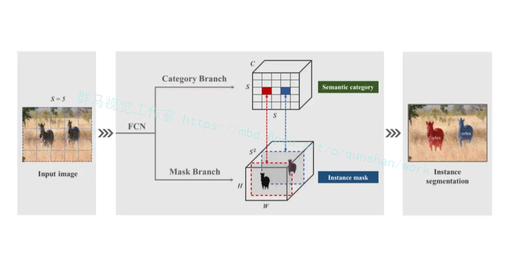
SOLO需要一个在空间上变化的模型，或者更准确地说，位置敏感的模型，因为我们的分割掩模取决于网格单元，必须由不同的特征通道分开。
具体地说，文章创建了一个与输入具有相同空间大小的张量，该张量包含归一化为[-1.1]的像素坐标。然后这个张量被连接到输入特征并传递到下面的层。通过让卷积访问它自己的输入坐标，我们将空间功能添加到传统的FCN模型中。如果原始特征张量的大小为HxWxD,则新张量的大小为HxW×(D+2)，其中后两个通道为x-y像素坐标。
在SOLO中，类别预测和对应的掩模自然通过它们的参考网格单元k =i·S＋j关联起来。在此基础上，SOLO可以直接形成每个网格的最终实例分割结果。原始实例分割结果是通过收集所有网格结果生成的。最后，使用非最大抑制(non-maximum-suppression,NMS)来获得最终的实例分割结果。不需要其他后处理操作
我们使用FPN，它为每一层生成一个具有固定数量通道(通常为256-d)的不同大小的金字塔特征图。这些映射用作每个预测头的输入:语义类别和实例掩码。头部的权重在不同层上共享。在这个场景中，只有最后的1×1 conv不共享。
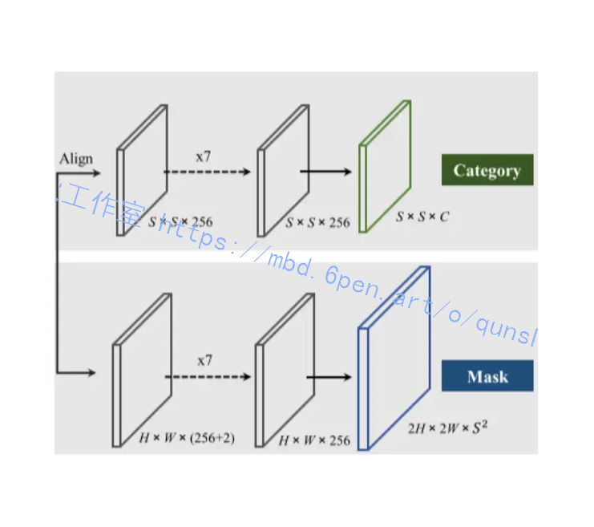

# 8.引入Decoupled head（解耦合头）
#### 耦合头(Coupled head)
耦合头通常是将卷积层О输出的特征图直接送入几个全连接层或卷积层中，以生成目标位置和类别的输出。
优点:
·设计思路简单
缺点:
·需要大量的参数和计算资源，容易出现过拟合
#### 解耦合头(Decoupled head)
解耦合头则是将目标位置和类别信息分别提取出来，通过不同的网络分支分别学习，最后再进行融合。
优点:
·可以有效减少参数量和计算复杂度
·增强模型的泛化能力和鲁棒性
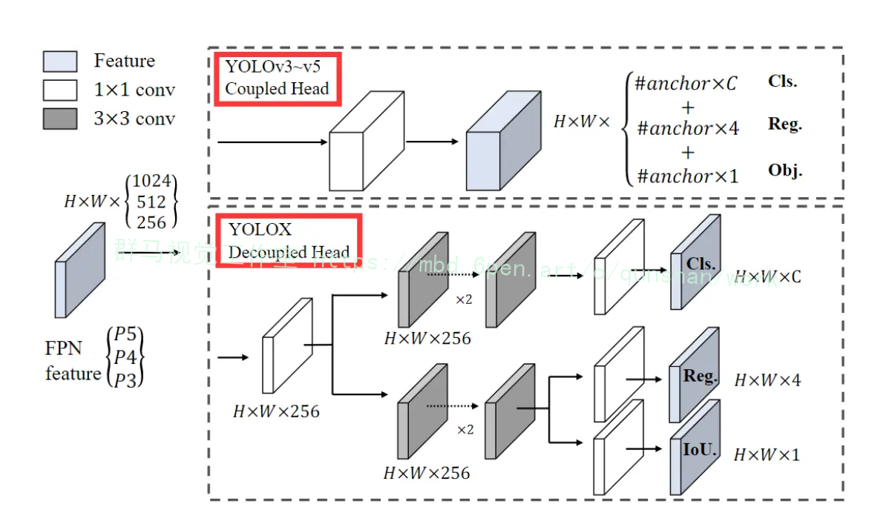

# 9.引入dice_loss损失
dice loss来自文章VNet(V-Net: Fully Convolutional Neural Networks for Volumetric
Medical lmage Segmentation)，旨在应对语义分割中正负样本强烈不平衡的场景。本文通过理论推导和实验验证的方式对dice loss进行解析，帮助大家去更好的理解和使用。
#### dice loss定义
dice loss 来自dice coefficient，是一种用于评估两个样本的相似性的度量函数，取值范围在0到1之间，取值越大表示越相似。dice coefficient定义如下:
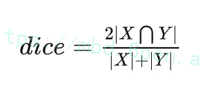

其中其中|X∩Y|是X和Y之间的交集，|X|和|Y|分表表示X和Y的元素的个数，分子乘2为了保证分母重复计算后取值范围在[0,1]之间。
因此dice loss可以写为:
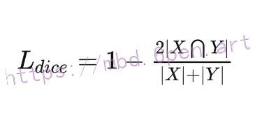

对于二分类问题，一般预测值分为以下几种:
.TP: true positive，真阳性，预测是阳性，预测对了，实际也是i正例。
·TN: true negative，真阴性，预测是阴性，预测对了，实际也是负例。
·FP: false positive，假阳性，预测是阳性，预测错了，实际是负例。
·FN: false negative，假阴性，预测是阴性，预测错了，实际是正例。
从dice loss的定义可以看出，dice loss是一种区域相关的loss。意味着某像素点的loss以及梯度值不仅和该点的label以及预测值相关，和其他点的label以及预测值也相关，这点和ce (交叉嫡cross entropy) loss 不同。因此分析起来比较复杂，这里我们简化一下，首先从loss曲线和求导曲线对单点输出方式分析。然后对于多点输出的情况，利用模拟预测输出来分析其梯度。而多分类softmax是sigmoid的一种推广，本质一样，所以这里只考虑sigmoid输出的二分类问题，首先sigmoid函数定义如下:
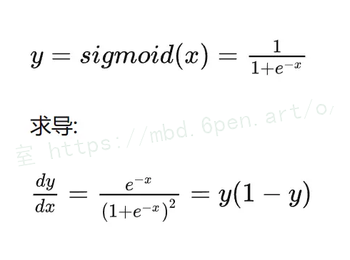
在使用dice loss时，一般正样本为小目标时会产生严重的震荡。因为在只有前景和背景的情况下，小目标一旦有部分像素预测错误，那么就会导致loss值大幅度的变动，从而导致梯度变化剧烈。可以假设极端情况，只有一个像素为正样本，如果该像素预测正确了，不管其他像素预测如何，loss就接近0，预测错误了，loss接近1。而对于ce loss，loss的值是总体求平均的，更多会依赖负样本的地方。
dice loss对正负样本严重不平衡的场景有着不错的性能，训练过程中更侧重对前景区域的挖掘。但训练loss容易不稳定，尤其是小目标的情况下。另外极端情况会导致梯度饱和现象。

# 10.系统整合
下图[完整源码＆环境部署视频教程＆数据集＆自定义UI界面](https://s.xiaocichang.com/s/a633c1)
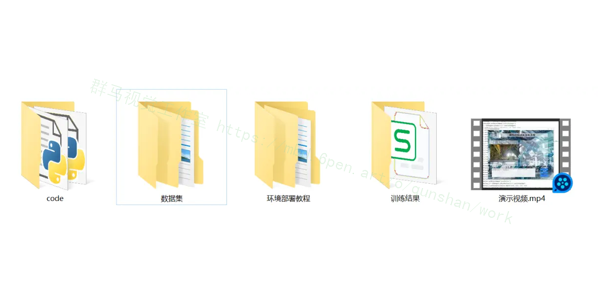

参考博客[《基于改进SOLO的钢包挂钩调度指挥系统（部署教程＆源码）》](https://mbd.pub/o/qunshan/work)


# 11.参考文献
---
[1][吴星](https://s.wanfangdata.com.cn/paper?q=%E4%BD%9C%E8%80%85:%22%E5%90%B4%E6%98%9F%22),[林林](https://s.wanfangdata.com.cn/paper?q=%E4%BD%9C%E8%80%85:%22%E6%9E%97%E6%9E%97%22),[陈海军](https://s.wanfangdata.com.cn/paper?q=%E4%BD%9C%E8%80%85:%22%E9%99%88%E6%B5%B7%E5%86%9B%22),等.[基于小波阈值法的脉搏波去噪算法](https://d.wanfangdata.com.cn/periodical/bjswyxgc202101005)[J].[北京生物医学工程](https://sns.wanfangdata.com.cn/perio/bjswyxgc).2021,(1).DOI:10.3969/j.issn.1002-3208.2021.01.005.

[2][白洋](https://s.wanfangdata.com.cn/paper?q=%E4%BD%9C%E8%80%85:%22%E7%99%BD%E6%B4%8B%22).[建筑起重机：产品迅速迭代，智能化渐成行业共识](https://d.wanfangdata.com.cn/periodical/jsjxjsygl202101017)[J].[建设机械技术与管理](https://sns.wanfangdata.com.cn/perio/jsjxjsygl).2021,34(1).37-39.

[3][饶文利](https://s.wanfangdata.com.cn/paper?q=%E4%BD%9C%E8%80%85:%22%E9%A5%B6%E6%96%87%E5%88%A9%22).[室内三维定位分类、方法、技术综述](https://d.wanfangdata.com.cn/periodical/dbch202103046)[J].[测绘与空间地理信息](https://sns.wanfangdata.com.cn/perio/dbch).2021,(3).DOI:10.3969/j.issn.1672-5867.2021.03.046.

[4][周巍](https://s.wanfangdata.com.cn/paper?q=%E4%BD%9C%E8%80%85:%22%E5%91%A8%E5%B7%8D%22).[图像识别技术在工业设计信息交互中的应用](https://d.wanfangdata.com.cn/periodical/gysj202101019)[J].[工业设计](https://sns.wanfangdata.com.cn/perio/gysj).2021,(1).

[5][刘淑香](https://s.wanfangdata.com.cn/paper?q=%E4%BD%9C%E8%80%85:%22%E5%88%98%E6%B7%91%E9%A6%99%22).[基于最小二乘法的桥式起重机机械臂关节控制系统设计](https://d.wanfangdata.com.cn/periodical/jsjzdclykz202105019)[J].[计算机测量与控制](https://sns.wanfangdata.com.cn/perio/jsjzdclykz).2021,(5).DOI:10.16526/j.cnki.11-4762/tp.2021.05.019.

[6][周奇才](https://s.wanfangdata.com.cn/paper?q=%E4%BD%9C%E8%80%85:%22%E5%91%A8%E5%A5%87%E6%89%8D%22),[张蕴](https://s.wanfangdata.com.cn/paper?q=%E4%BD%9C%E8%80%85:%22%E5%BC%A0%E8%95%B4%22),[熊肖磊](https://s.wanfangdata.com.cn/paper?q=%E4%BD%9C%E8%80%85:%22%E7%86%8A%E8%82%96%E7%A3%8A%22),等.[桥式起重机制动阶段防摇控制方案研究](https://d.wanfangdata.com.cn/periodical/sxjx202101003)[J].[机械工程与自动化](https://sns.wanfangdata.com.cn/perio/sxjx).2021,(1).

[7][易佳明](https://s.wanfangdata.com.cn/paper?q=%E4%BD%9C%E8%80%85:%22%E6%98%93%E4%BD%B3%E6%98%8E%22),[胡小龙](https://s.wanfangdata.com.cn/paper?q=%E4%BD%9C%E8%80%85:%22%E8%83%A1%E5%B0%8F%E9%BE%99%22).[基于深度学习的铝厂工业自动浇筑中的图像识别](https://d.wanfangdata.com.cn/periodical/hbdxxb202003015)[J].[湖北大学学报（自然科学版）](https://sns.wanfangdata.com.cn/perio/hbdxxb).2020,(3).

[8][温皓白](https://s.wanfangdata.com.cn/paper?q=%E4%BD%9C%E8%80%85:%22%E6%B8%A9%E7%9A%93%E7%99%BD%22).[臂架起重机领域标准化发展与展望](https://d.wanfangdata.com.cn/periodical/zgbzh202007033)[J].[中国标准化](https://sns.wanfangdata.com.cn/perio/zgbzh).2020,(7).DOI:10.3969/j.issn.1002-5944.2020.07.019.

[9][任丽华](https://s.wanfangdata.com.cn/paper?q=%E4%BD%9C%E8%80%85:%22%E4%BB%BB%E4%B8%BD%E5%8D%8E%22).[冶金桥式起重机检验要点分析](https://d.wanfangdata.com.cn/periodical/cyykjlt202005029)[J].[产业与科技论坛](https://sns.wanfangdata.com.cn/perio/cyykjlt).2020,(5).

[10][李俊](https://s.wanfangdata.com.cn/paper?q=%E4%BD%9C%E8%80%85:%22%E6%9D%8E%E4%BF%8A%22).[铸造起重器的西门子电气控制系统设计](https://d.wanfangdata.com.cn/periodical/zgsbgc202022058)[J].[中国设备工程](https://sns.wanfangdata.com.cn/perio/zgsbgc).2020,(22).


---
#### 如果您需要更详细的【源码和环境部署教程】，除了通过【系统整合】小节的链接获取之外，还可以通过邮箱以下途径获取:
#### 1.请先在GitHub上为该项目点赞（Star），编辑一封邮件，附上点赞的截图、项目的中文描述概述（About）以及您的用途需求，发送到我们的邮箱
#### sharecode@yeah.net
#### 2.我们收到邮件后会定期根据邮件的接收顺序将【完整源码和环境部署教程】发送到您的邮箱。
#### 【免责声明】本文来源于用户投稿，如果侵犯任何第三方的合法权益，可通过邮箱联系删除。